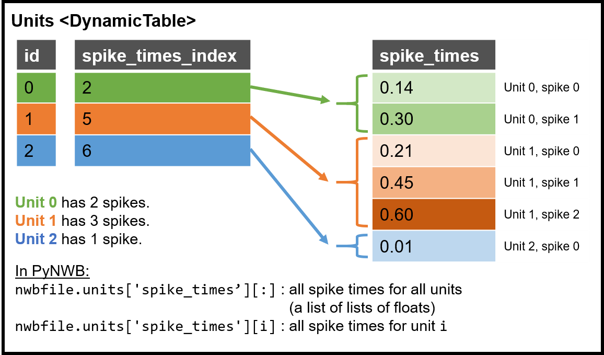
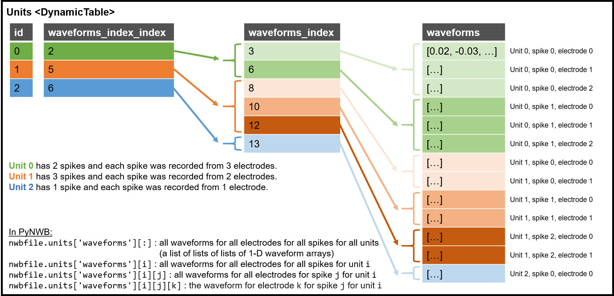
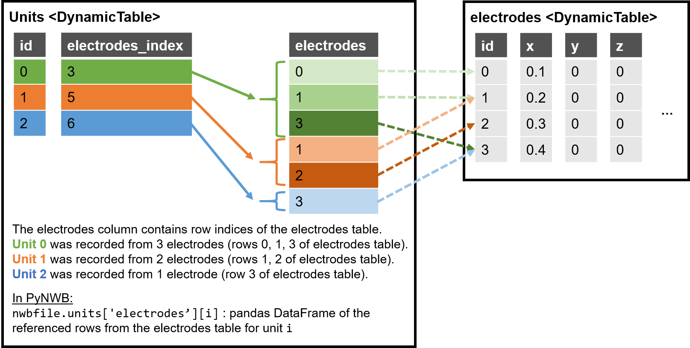

Overview
========

The `NWB Format <https://www.nwb.org/nwb-neurophysiology/>`_ is a core component of the
`Neurodata Without Borders (NWB) <https://www.nwb.org/nwb-software/>`_  project.
The NWB format is designed to store general optical and electrical physiology data in a way that
is both understandable to humans as well as accessible to programmatic interpretation. The format is
designed to be friendly to and usable by software tools and analysis
scripts, and to impose few a priori assumptions about data
representation and analysis.

The NWB format uses the following main primitives to hierarchically organize neuroscience data :

* A *Group* is similar to a folder and may contain an arbitrary number of other groups and datasets,
* A *Dataset* describes an n-dimensional array and provides the primary means for storing data,
* An *Attribute** is a small dataset that is attached to a specific group or dataset and is typically used to
  store metadata specific to the object they are associated with, and
* A *Link* is a reference to another group or dataset.

The NWB format is formally described via formal specification documents using the `NWB specification language <http://schema-language.readthedocs.io/en/latest/>`_ .
HDF5 currently serves as the main format for storing data in the NWB format (see http://nwb-storage.readthedocs.io/en/latest/ for details).
The `PyNWB <http://pynwb.readthedocs.io/en/stable/>`_ API is available to enable users to efficiently interact with NWB format files.

The NWB format uses a modular design in which all main semantic components of the format have
a unique *neurodata_type* (similar to a Class in object-oriented design)(:numref:`sec_neurodata_type_intro`).
This allows for reuse and extension of types through inclusion and inheritance. All datasets and groups
in the format can be uniquely identified by either their name and/or *neurodata_type*.

Two important base types in the NWB format are *NWBContainer* and *TimeSeries*. *NWBContainer* defines a
generic container for storing collection of data and is used to define common features and functionality
across data containers (see :numref:`sec_nwbcontainer_intro`). *TimeSeries* is a central component in
the NWB format for storing complex temporal series (see :numref:`sec_timeseries_intro`). In the format,
these types are then extended to define more specialized types. To organize and define collections of processed data
from common data processing steps, the NWB format then defines the concept of *ProcessingModule* where each processing
step is represented by a corresponding *NWBDataInterface* (an extension of *NWBContainer*)
(see :numref:`sec-data-processing-modules` for details).

At a high level, data is organized into the following main groups:

* *acquisition/* : data streams recorded from the system, including ephys, ophys, tracking, etc.,
* *intervals/* : experimental intervals,
* *stimulus/* : stimulus data,
* *general/* : experimental metadata, including protocol, notes and description of hardware device(s).
* *processing/* : standardized processing modules, often as part of intermediate analysis of data that is necessary to perform before scientific analysis,
* *analysis/* : lab-specific and custom scientific analysis of data.

The high-level data organization within NWB files is described in detail in :numref:`sec-NWBFile`.
The top-level datasets and attributes are described in :numref:`table-NWBFile-data` and
the top-level organization of data into groups is described in :numref:`table-NWBFile-groups`.

.. _sec_neurodata_type_intro:

``neurodata_type`` : Assigning types to specifications
------------------------------------------------------

The concept of a *neurodata_type* is similar to the concept of a Class in object-oriented programming.
In the NWB format, groups or datasets may be given a unique *neurodata_type*. The *neurodata_type*
allows the unique identification of the type of objects in the format and also enable the reuse of
types through the concept of inheritance. A group or dataset may, hence, define a new *neurodata_type*
while extending an existing type. E.g., *AbstractFeatureSeries* defines a new type that
inherits from *TimeSeries*.

.. _sec_nwbcontainer_intro:

``NWBContainer``, ``NWBData``, ``NWBDataInterface``: Base neurodata_types for containers and datasets
-----------------------------------------------------------------------------------------------------

:ref:`NWBContainer <sec-NWBContainer>` is a specification of a group that defines a generic container for
storing collections of data. :ref:`NWBContainer <sec-NWBContainer>` serves as the base type for all main data containers
(including :ref:`TimeSeries <sec-TimeSeries>`) of the core NWB data
format and allows us to define and integrate new common functionality in a central place and via common mechanisms
(see :numref:`sec-NWBContainer`).

:ref:`NWBDataInterface <sec-NWBDataInterface>` extends :ref:`NWBContainer <sec-NWBContainer>` and
serves as base type for primary data (e.g., experimental or analysis data) and is used to
distinguish in the schema between non-metadata data containers and metadata containers
(see :numref:`sec-NWBDataInterface`).


:ref:`NWBData <sec-NWBData>` is a specification of a Dataset that functions as a common base neurodata_type for
datasets with an assigned *neurodata_type* (see :numref:`sec-NWBData`).

.. note::

    The concept of :ref:`NWBContainer <sec-NWBContainer>` and :ref:`NWBData <sec-NWBData>` have been introduced in
    NWB 2. :ref:`NWBDataInterface <sec-NWBDataInterface>` (also introduced in NWB 2) replaces ``Interface``
    from NWB 1.x. ``Interface``  was renamed to *NWBDataInterface* to ease intuition and
    the concept was generalized via :ref:`NWBContainer <sec-NWBContainer>` to provide a common base for
    data containers (rather than being specific to *ProcessingModules* as in NWB 1.x).

.. _sec_timeseries_intro:

``Time Series`` : A base neurodata_type for storing time series data
--------------------------------------------------------------------

The file format is designed around a data structure called a
*TimeSeries* which stores time-varying data. A *TimeSeries* is a
superset of several neurodata_types, including signal events, image stacks
and experimental events. To account for different storage requirements
and different modalities, a *TimeSeries* is defined in a minimal form
and it can be extended (i.e., subclassed) to account for different
modalities and data storage requirements (see :numref:`sec-extending-the-format`).

Each *TimeSeries* has its own HDF5 group, and all datasets belonging to
a *TimeSeries* are in that group. In particular, a *TimeSeries* defines
components to store *data* and *time*.

The *data* element in the *TimeSeries* will typically be an array of any
valid HDF5 data type (e.g., a multi-dimensional floating point array).
The data stored can be in any unit. The attributes of the data field
must indicate the SI unit that the data relates to (or appropriate
counterpart, such as color-space) and the multiplier necessary to
convert stored values to the specified SI unit.

*TimeSeries* support provides two time objects representations.
The first, *timestamps*, stores time information that is corrected
to the experiment's time base (i.e., aligned to a master clock,
with time-zero aligned to the starting time of the experiment).
This field is used for data processing and
subsequent scientific analysis. The second, *sync*, is an optional group
that can be used to store the sample times as reported by the
acquisition/stimulus hardware, before samples are converted to a common
time-base and corrected relative to the master clock. This approach
allows the NWB format to support streaming of data directly from
hardware sources.

In addition to data and time, the *TimeSeries* group can be used to store additional
information beyond what is required by the
specification. I.e., an end user is free to add additional key/value
pairs as necessary for their needs via the concept of extensions. It should be noted that such
lab-specific extensions may not be recognized by analysis tools/scripts
existing outside the lab. Extensions are described in section (see :numref:`sec-extending-the-format`).


.. _sec-data-processing-modules:

Data Processing Modules: Organizing processed data
--------------------------------------------------

NWB uses :ref:`ProcessingModule <sec-ProcessingModule>` to store
data for—and represent the results of—common
data processing steps, such as spike sorting and image segmentation,
that occur before scientific analysis of the data. Processing modules store the
data used by software tools to calculate these intermediate results.
All processing modules are stored directly in the group
`/processing <#groups-processing>`__. The name of each module is chosen by the
data provider (i.e. processing modules have a "variable" name). The particular data
within each processing module is specified by one or more
:ref:`NWBDataInterface <sec-NWBDataInterface>`, which are
groups residing directly within a processing module. Each NWBDataInterface has a unique
neurodata_type (e.g., *ImageSegmentation*) that describes and defines the data
contained in the NWBDataInterface. For NWBDataInterfaces designed for use with
processing modules, a default name (usually the same as the neurodata_type) is
commonly specified to further ease identification of the data in a file. However, to
support storage of multiple instances of the same subtype in the
same processing module, NWB allows users to optionally define custom names as well.


.. _sec-extending-the-format:

Extending the format
--------------------

The data organization presented in this document constitutes the *core*
NWB format. Extensibility is handled via the concept of extensions,
allowing users to extend (i.e., add to) existing and create new neurodata_types
definitions for storing custom data. To avoid collisions between extensions,
extensions are defined as part of custom namespaces (which typically import
the core NWB namespace). Extensions to the format are written using the
`Specification Language <http://schema-language.readthedocs.io/en/latest/>`_ .
To ease development of extensions, the PyNWB_
(and `HDMF <https://github.com/hdmf-dev/hdmf>`_ used by PyNWB) API provides dedicated
data structures that support programmatic creation and use of extensions. An
example for extending NWB using PyNWB_ is available at
https://pynwb.readthedocs.io/en/stable/tutorials/general/extensions.html and
additional details are also available as part of the PyNWB_ tutorials
https://pynwb.readthedocs.io/en/stable/tutorials/index.html .

Creating extensions allows adding and documenting new data to NWB, interaction with
custom data via the API, validation of custom data contents, sharing and collaboration
of extensions and data. Popular extensions may be proposed and
added to the official format specification after community discussion and review.
To propose a new extensions for the NWB core format you may file an issue
at https://github.com/NeurodataWithoutBorders/nwb-schema/issues .


.. _sec-extending-the-ts-and-nc:

Extending TimeSeries and NWBContainer
^^^^^^^^^^^^^^^^^^^^^^^^^^^^^^^^^^^^^^

Like any other neurodata_type, *TimeSeries* can be extended via extensions
by defining corresponding derived neurodata_types. This is typically done to
to represent more narrowly focused modalities (e.g.,
electrical versus optical physiology) as well as new modalities (e.g.,
video tracking of whisker positions). When a neurodata_type inherits from *TimeSeries*,
new data objects (i.e., datasets, attributes, groups, and links)
can be added while all objects of the parent *TimeSeries* type are
inherited and, hence, part of the new neurodata_type. Section :numref:`sec-TimeSeries`
includes a list of all *TimeSeries* types.

Extending *NWBContainer* works in the same way, e.g., to create more specific types for
data processing.


Common attributes
-----------------

All NWB Groups and Datasets with an assigned neurodata_type have three required attributes: `neurodata_type`,
`namespace`, and `object_id`.

- ``neurodata_type`` (variable-length string) is the name of the NWB primitive that this group or dataset maps onto
- ``namespace`` (variable-length string) is the namespace where ``neurodata_type`` is defined, e.g. "core" or the
  namespace of an extension
- ``object_id`` (variable-length string) is a universally unique identifier for this object within its hierarchy.
  It should be set to the string representation of a random UUID version 4 value
  (see `RFC 4122 <https://tools.ietf.org/html/rfc4122>`_) upon first creation. It is **not** a hash of the data. Files
  that contain the exact same data but were generated in different instances will have different ``object_id`` values.
  Currently, modification of an object does not require its ``object_id`` to be changed.


Comments and Definitions
========================

Notation
--------

The description of the format is divided into subsection based on *neurodata_type*. Each *neurodata_type* section includes:

* A basic description of the type
* An optional figure describing the organization of data within the type
* A set of tables describing the datasets, attributes and groups contained in the type.
* An optional set of further subsections describing the content of subgroups contained in the given *neurodata_type*.

In the tables we use the following notation in the **Id** column to uniquely identify datasets, groups, attributes:

* ```name``` describes the unique name of an object
* ```<neurodata_type>``` describes the ```neurodata_type``` of the object in case that the object does not have a unique name
* ```—``` prefixes are used to indicate the depth of the object in the hierarchy to allow identification of the parent
  of the object. E.g., an object with a ```——``` prefix will belong to the previous object with a ```—``` prefix.

Here a quick example:

.. tabularcolumns:: |p{5cm}|p{1cm}|p{9cm}|
.. table:: Example illustrating the description of the contents of ```neurodata_types```.
    :class: longtable

    +---------------------------+-------------+---------------------------------------------------------------------------------------------------------+
    | Id                        | Type        | Description                                                                                             |
    +===========================+=============+=========================================================================================================+
    | <MyTimeSeries>            | group       | Top level group for the neurodata_type. The group the neurodata_type *MyTimeSeries* but no fixed name   |
    +---------------------------+-------------+---------------------------------------------------------------------------------------------------------+
    | —myattr                   | attribute   | Attribute with the fixed name myattr defined on <MyTimeSeries>                                          |
    +---------------------------+-------------+---------------------------------------------------------------------------------------------------------+
    | —mydata                   | dataset     | Required dataset with a unique name contained in <MyTimeSeries>                                         |
    +---------------------------+-------------+---------------------------------------------------------------------------------------------------------+
    | ——unit                    | attribute   | Attribute unit defined on the dataset .mydata                                                           |
    +---------------------------+-------------+---------------------------------------------------------------------------------------------------------+
    | —myotherdata              | dataset     | Optional dataset with a unique name contained in <MyTimeSeries>                                         |
    +---------------------------+-------------+---------------------------------------------------------------------------------------------------------+
    | —<ElectricalSeries>       | group       | Optional set of groups with the neurodata_type ElectricalSeries that are contained in <MyTimeSeries>    |
    +---------------------------+-------------+---------------------------------------------------------------------------------------------------------+


Storing Time Values
-------------------

All times are stored in seconds using double precision (64-bit) floating
point values. A smaller floating point value, e.g., 32-bit, is **not**
permitted for storing times. This is because significant errors for time
can result from using smaller data sizes. Throughout this document,
sizes (number of bits) are specified for many datatypes (e.g., float32).
For fields with a specified size, larger sizes can be used, so long as
the selected size encompasses the full range of data, and for floats,
without loss of significant precision.

Links and data references
-------------------------

**Soft Links:** In some instances, the specification refers to links. When links
are made within a file, NWB uses soft-links and not hard-links.
This is because soft-links distinguish between the link and the
target of the link, whereas hard-links cause multiple names (paths) to
be created for the target, and there is no way to determine which of
these names are preferable in a given situation. If the target of a soft
link is removed (or moved to another location), then the soft link will "dangle,"
that is point to a target that no longer exists. For this reason, moving
or removing targets of soft links should be avoided unless the links are
updated to point to the new location.

**Object References:** Object references are similar
to SoftLinks but instead of being stored as elements in the data hierarchy
(similar to a Group or Dataset) the object reference defines a data type
on a Dataset, i.e., the object references are stored as elements in a
Dataset.

**Region References:** Region references are similar to object references
but instead of pointing to another Group/Dataset as a whole a region reference
defines an additional selection and as such describe a reference to a subset
of a dataset.


Design notes
------------

**Data type sizes**

The listed size of integers and floating point values is the minimum size.
The size of the data type should be large enough to store the
required data, and preferably not larger. 64-bit floating point (double)
is required for timestamps, while 32-bit floating point is largely
sufficient for other uses.

**Extra fields**

All parts of an NWB file should be governed by either the core schema or
defined in a neurodata extension (NDX). *Extra fields* are any datasets,
attributes, groups, links etc. that are included in a file but which are
not described by the NWB schema or a neurodata extension (NDX). Extra fields
are not considered  part of the NWB file and as such, any NWB API may ignore
extra fields. For API's this specifically means:

* an NWB file that includes extra fields should be readable by the API
  as long as the file is otherwise valid,
* an API is permitted to ignore extra fields on read,
* an API is permitted to ignore (including remove) extra fields on write.

In practice, the use of extra fields is highly discouraged and instead neurodata
extensions (NDX) should be used to extend NWB to include additional fields
if necessary.

**Why do timestamps\_link and data\_link record linking between
datasets, but links between epochs and timeseries are not recorded?**

Epochs have a link to entire timeseries (i.e., the HDF5 group). If 100
epochs link to a time series, there is only one time series. The data
and timestamps within it are not shared anywhere (at least from the
epoch linking). An epoch is an entity that is put in for convenience and
annotation so there isn't necessarily an important association between
what epochs link to what time series (all epochs could link to all time
series).

The timestamps\_link and data\_link fields refer to links made between
time series, such as if timeseries A and timeseries B, each having
different data (or time) share time (or data). This is much more
important information as it shows structural associations in the data.


Tables and ragged arrays
------------------------

The NWB schema includes several tables, such as for storing data/metadata
about trials, epochs, single units and multi-units, electrodes, and ROIs.
All of the tables in NWB derive from the base data type, DynamicTable.
DynamicTable is a column-based representation of a table that allows
users to add custom columns (of type VectorData) that are not
pre-defined in the specification. This is useful for handling types of
data where every experiment or lab may want to store information
unique to that experiment or lab, e.g., metadata
related to the trials in a session or spike sorting metrics.

DynamicTable objects typically contain columns that are of equal length,
where the i-th element of a column corresponds to the i-th element of
all of the other columns. In other words, each row has a single item
in each column. However, in some situations, users may wish to store and
associate multiple items in a single column for each row. For example,
in the Units table, each row represents a single sorted unit and each
unit has multiple spike times associated with it, where the number of
spike times differs between units (rows). This is sometimes called a
ragged array or jagged array.

Ragged array columns can be created by creating a primary VectorData
column that contains all of the data values (e.g., spike times) and
creating a secondary VectorIndex column that contains a mapping from rows
to elements of its target VectorData column. The VectorIndex column has the same
number of elements (rows) as the rest of the table.

The values of the VectorIndex column follow the mapping such that the data
associated with the first row is at VectorData[0:VectorIndex[0]], and the data
associated with the second row is at VectorData[VectorIndex[0]:VectorIndex[1]],
and so on.



Doubly ragged arrays
---------------------



References to rows of a table
------------------------------


